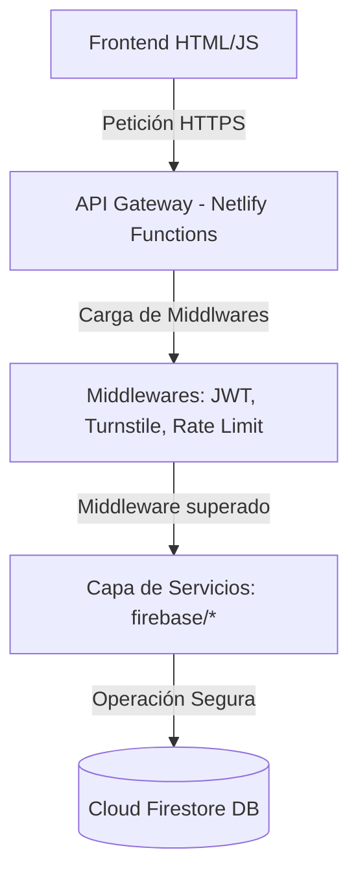

# Arquitectura Aero Panels — Backend Infrastructure

Este documento detalla la arquitectura modular implementada para el Panel de Control de Aero, integrando la interfaz frontend estática, Netlify Functions (Serverless API) y Google Cloud Firestore.

## Diagrama de Flujo



## Estructura del Proyecto

La infraestructura sigue un patrón modular limpio e independiente:

```
├── config/
│   └── firebase-service-account.example.json   # Plantilla para clave de cuenta de servicio local
├── js/
│   ├── api/                                    # Peticiones API frontend (vacío para crecimiento)
│   ├── auth/                                   # Lógicas de auth frontend (vacío para crecimiento)
│   ├── dashboard/                              # Lógicas de dashboard frontend (vacío para crecimiento)
│   ├── ui/                                     # Efectos visuales, sonidos y temas (vacío para crecimiento)
│   └── main.js                                 # Script principal de inicio y sesiones
├── middleware/
│   └── index.js                                # JWT, CORS, Turnstile y Rate Limit
├── netlify/
│   └── functions/
│       └── v1/                                 # Endpoints API Versionada
│           ├── admin.js                        # Panel de control de administradores
│           ├── auth.js                         # Registro e inicio de sesión
│           ├── config.js                       # Configuración pública (Turnstile sitekey)
│           ├── contact.js                      # Envío de formulario de contacto
│           ├── recovery.js                     # Solicitudes de recuperación multipart
│           └── user.js                         # Perfil de usuario autenticado
├── services/
│   ├── ai/                                     # Integraciones de Inteligencia Artificial (Reservado)
│   ├── discord/                                # Conexiones y logs con Discord (Reservado)
│   └── firebase/                               # Módulos de base de datos
│       ├── config.js                           # Creador de credenciales dinámico
│       ├── firestore.js                        # Singleton de conexión con Firebase
│       ├── logs.js                             # Logger de auditoría a Firestore
│       ├── recuperaciones.js                   # Repositorio de recuperación de cuentas
│       ├── roles.js                            # Gestor de permisos y accesos
│       ├── sesiones.js                         # Gestor de tokens hashed en DB
│       └── usuarios.js                         # Repositorio de cuentas y contraseñas
├── utils/
│   ├── bcrypt.js                               # Cifrado de contraseñas (bcryptjs)
│   ├── jwt.js                                  # Firma y decodificación de tokens de sesión
│   ├── multipart.js                            # Parser manual de FormData / Multipart
│   └── responses.js                            # Formateador de respuestas HTTP estándar
├── .env.example                                # Variables de entorno del sistema
├── .gitignore                                  # Archivos ignorados por seguridad
├── firebase.json                               # Ajustes del entorno de Firebase
├── firestore.indexes.json                      # Índices compuestos de Firestore
├── firestore.rules                             # Reglas de seguridad ultra-restrictivas (Lockdown)
├── netlify.toml                                # Enrutamiento y redirecciones de Netlify
└── package.json                                # Dependencias del backend
```

## Medidas de Seguridad Clave

1. **Firestore Lockdown**: Las reglas de `firestore.rules` bloquean completamente el acceso directo desde el SDK de cliente. Ningún usuario malicioso puede extraer datos mediante llamadas directas a Firestore. Toda operación se audita y ejecuta a través del backend Server SDK (`firebase-admin`).
2. **Hashed Tokens**: Las sesiones no guardan el token en texto plano. Se almacena un hash `tokenHash` (SHA-256) garantizando que si la base de datos se ve comprometida, no se puedan suplantar sesiones activas.
3. **No ID Enumeration**: Los usuarios en la colección `usuarios` no usan su número administrativo como ID del documento (evitando ataques de enumeración). En su lugar se autogenera un hash/ID aleatorio y el campo se valida internamente.
4. **Protección Turnstile**: Se valida a nivel de backend en el registro, el login fallido, y los formularios de contacto y recuperación.
5. **Cifrado Fuerte**: Se implementa `bcryptjs` con 10 rondas de sal para el almacenamiento seguro de contraseñas.
